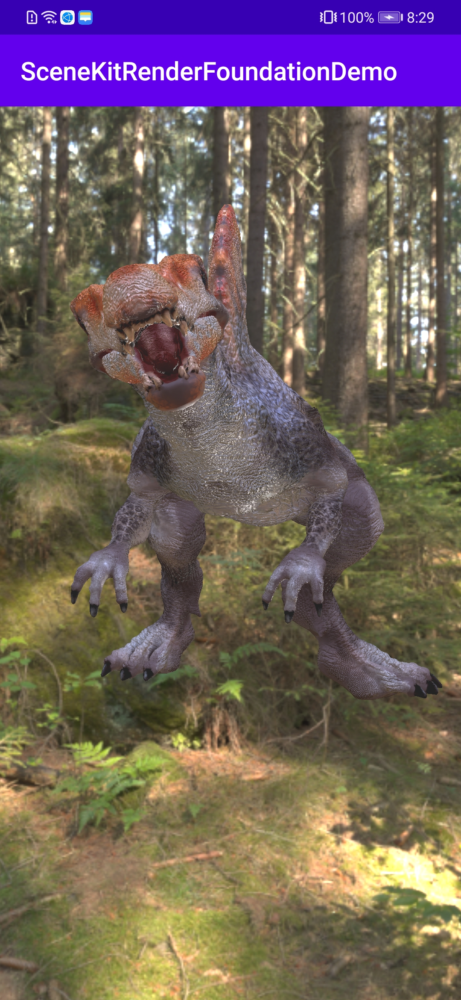
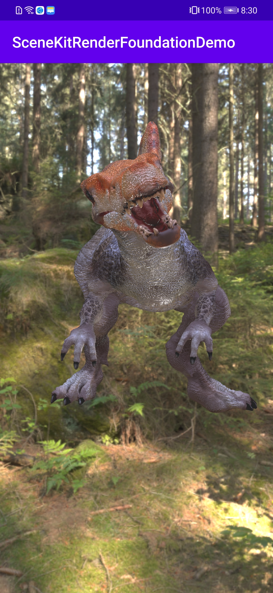

# HMS SceneKit RenderFoundation Demo
English | [中文](README_ZH.md)
## Table of Contents

* [Introduction](#introduction)
* [Getting Started](#getting-started)
* [Supported Environments](#supported-environments)
* [Result](#result)
* [License](#license)

## Introduction

The SceneKitRenderFoundationDemo app demonstrates a sample to call the RenderView.

[Read more about HMS Scene Kit](<https://developer.huawei.com/consumer/en/hms/huawei-scenekit>).

## Getting-Started

1. Check whether the Android studio development environment is ready. Open the sample code project directory with file "build.gradle" in Android Studio.
2. Register a [HUAWEI account](https://developer.huawei.com/consumer/en/).
3. Create an app and configure the app information in AppGallery Connect.
See details: [HUAWEI Scene Kit Development Preparation](https://developer.huawei.com/consumer/en/doc/development/graphics-Guides/dev-process-0000001064186384)
4. To build this demo, please first import the demo in the Android Studio (3.6.1+).
5. Run the sample on your Android device or emulator.

## Supported-Environments

* AndroidStuido 3.6.1 or a later version is recommended.
* Java SDK 1.8 is recommended.
* HMS Core (APK) 4.0.2.300 or later
* EMUI 10.0 or a later version is recommended.

## Result

 

## Technical Support

If you are still evaluating HMS Core, obtain the latest information about HMS Core and share your insights with other developers at [Reddit](https://www.reddit.com/r/HuaweiDevelopers/.).

- To resolve development issues, please go to [Stack Overflow](https://stackoverflow.com/questions/tagged/huawei-mobile-services?tab=Votes). You can ask questions below the huawei-mobile-services tag, and Huawei R&D experts can solve your problem online on a one-to-one basis.
- To join the developer discussion, please visit [Huawei Developer Forum](https://forums.developer.huawei.com/forumPortal/en/forum/hms-core).

If you have problems using the sample code, submit [issues](https://github.com/HMS-Core/hms-scene-fine--grained-demo/issues) and [pull requests](https://github.com/HMS-Core/hms-scene-fine--grained-demo/pulls) to the repository.

## License

SceneKitRenderFoundationDemo is licensed under the [Apache License, version 2.0](http://www.apache.org/licenses/LICENSE-2.0).
3D model 'Spinosaurus_animation' (no modified) published by seirogan under the [Creative Commons Attribution license](https://creativecommons.org/licenses/by/4.0/legalcode).
Learn more about [Spinosaurus_animation](https://sketchfab.com/3d-models/spinosaurus-animation-c11709dbf9e3472f9533343f1f342564).
