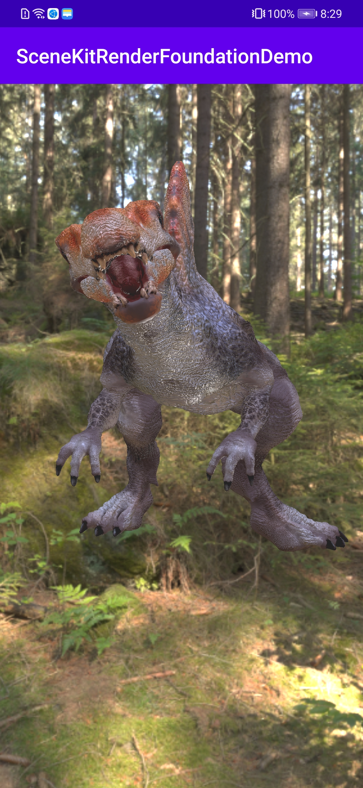
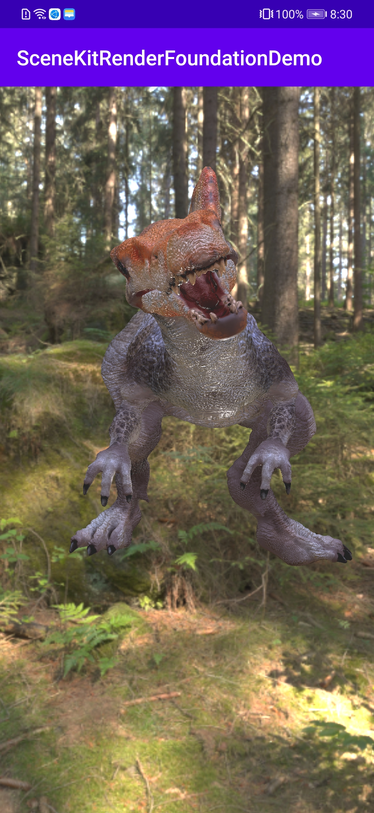

# 华为图形引擎服务原子化接口示例代码
中文 | [English](README.md)
## 目录

* [简介](#简介)
* [开发准备](#开发准备)
* [开发环境](#开发环境)
* [运行结果](#运行结果)
* [许可证](#许可证)

## 简介

图形引擎服务原子化接口示例代码演示如何调用RenderView接口进行图形渲染。

[了解更多关于图形引擎服务](https://developer.huawei.com/consumer/cn/hms/huawei-scenekit)。

## 开发准备

   1. 检查Android Studio开发环境是否准备就绪。就绪后，在Android Studio中打开示例代码项目级目录下的build.gradle文件。
   2. 注册[华为账号](https://developer.huawei.com/consumer)。
   3. 在AppGallery Connect中创建应用，配置应用信息。
      详情请查看: [华为图形引擎服务开发指南](https://developer.huawei.com/consumer/cn/doc/development/graphics-Guides/dev-process-0000001064186384)。
   4. 为了保证工程构建成功，请使用3.6.1版本以上的Android Studio。
   5. 在您的设备或模拟器上运行示例代码。

## 开发环境

* Android Stuido 3.6.1及以上版本
* JDK 1.8（推荐）
* HMS Core (APK) 4.0.2.300及以上版本
* EMUI 10.0及以上版本

## 运行结果

 

## 技术支持

如果您对HMS Core还处于评估阶段，可在[Reddit社区](https://www.reddit.com/r/HuaweiDevelopers/)获取关于HMS Core的最新讯息，并与其他开发者交流见解。

如果您对使用HMS示例代码有疑问，请尝试：

- 开发过程遇到问题上[Stack Overflow](https://stackoverflow.com/questions/tagged/huawei-mobile-services?tab=Votes)，在`huawei-mobile-services`标签下提问，有华为研发专家在线一对一解决您的问题。
- 到[华为开发者论坛](https://developer.huawei.com/consumer/cn/forum/blockdisplay?fid=18) HMS Core板块与其他开发者进行交流。

如果您在尝试示例代码中遇到问题，请向仓库提交[issue](https://github.com/HMS-Core/hms-scene-fine-grained-demo/issues)，也欢迎您提交[Pull Request](https://github.com/HMS-Core/hms-scene-fine-grained-demo/pulls)。

## 许可证

图形引擎服务原子化接口示例代码采用的许可证为[Apache License, version 2.0](http://www.apache.org/licenses/LICENSE-2.0)。

3D模型素材'Spinosaurus_animation'（未经修改），原作者为seirogan，采用的许可证为[Creative Commons Attribution license](https://creativecommons.org/licenses/by/4.0/legalcode)。

了解更多关于[Spinosaurus_animation](https://sketchfab.com/3d-models/spinosaurus-animation-c11709dbf9e3472f9533343f1f342564)。
